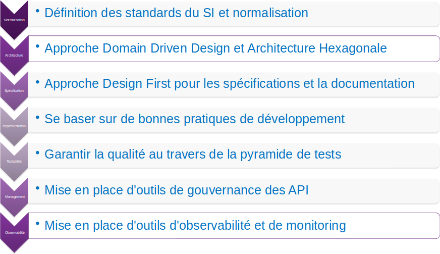
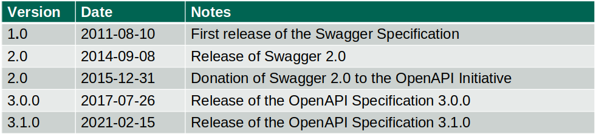

:classification: C0 - Public
:source-highlighter: pygments
:sectanchors:
:sectlinks:
:customcss: style/prez.css
:version: 1.0

[background-image=style/title-bg.png, state=title]
== API Design First 

Boostez le développement de vos APIs

[background-image=style/background/demarche.jpg, transition=none]
== Démarche API

[%step]

image:style/img-space.png[height=150]

[.notes]
--
Pour ma part je travaille autour des APIs depuis les années 2010, et fort de cette expériences j'ai donc proposé à ma société une démarche pour la mise en place d'APIs.

Cela part de la définition de standard, jusqu'à l'observabilité et le monitoring, en passant par l'architecture, les bonnes pratiques de développement et...

Ce qui nous intéresse aujourd'hui L'approche Design First...
--

[background-image=style/background/demarche.jpg, transition=none]
== Démarche API

image:style/demarche-api-dsg.png[]

image:style/img-space.png[height=150]

[background-image=style/background/code-first.jpg, transition=none]
== Code First

image:style/img-space.png[height=75]

[%step]
[.text-left]
* ON CODE DANS SON IDE
* ON TESTE VIA POSTMAN
* LA DOCUMENTATION ?
* LA COMMUNICATION ?

image:style/img-space.png[height=150]

[.notes]
--
Avant de parler de Design First voyons l'approche Code First.

Il s'agit de développer directement son API dans son IDE préféré

Pour tester on s'appuie sur des outils comme Postman, vu que c'est nous qui avons développé on sait de facto comment appelr notre API

Cependant cela manque de Documentation, un développeur comprendra ce code et saura comment appeler l'API, mais les autres ?

Dailleur lorsqu'on expose une API c'est pour qu'elle soit consommée par quelqu'un, il faut donc pouvoir expliquer à celu-ci comment appeler notre APIs.

Cela se faisait souvent via un documment annexe, et cela se passait souvent dans la douleur, fautes de frappes, erreurs dans la documentation.

Bilan c'est grandement perfectible
--

[background-image=style/background/design-first.jpg, transition=none]
== Le Design First

image:style/img-space.png[height=75]

[%step]
[.text-left]
* IMPLÉMENTER PLUS EFFICACEMENT VOS APIS
* INTÉGRER PLUS FACILEMENT LES APPELS À VOS APIS
* POSSIBILITÉ DE SIMULER VOS APIS
* DOCUMENTATION EN ADÉQUATION AVEC L'IMPLÉMENTATION RÉELLE

image:style/img-space.png[height=150]

[.notes]
--
N'y a t'il pas moyen de proposer un contrat d'interface, lorsque nous exposions des Webservices SOAP nous échangiosn avec le consommateur un contrat le fameux WSDL.

Le Design First va nous aider ​t doit nous permettre : 

D'implementer plus efficacement nos APIs 
Permettre aux consomateurs d'intégrer plus facilement des appels APIs
Ces deux points grâce à de la génération de code à partir du contrat d'interface

Mais ce contrat offre d'autres possibilité comme 
La possibilité de simuler une API ou servir de documentation technique qui est de facto en adéquation avec ce qui a été implémenté.
--

[background-image=style/background/openapi.jpg, transition=none]
== OpenAPI

image:style/img-space.png[height=50]

[%step]

image:style/img-space.png[height=50]

[%step]
http://spec.openapis.org/oas/v3.1.0[http://spec.openapis.org/oas/v3.1.0]

image:style/img-space.png[height=150]

[background-image=style/background/designer.jpg, transition=none]
== Définir son API

image:style/img-space.png[height=5]

[%step]
[.text-left]
* LES ROUTES
* LES VERBES HTTP
* LES PARAMÈTRES ET RÉPONSES
* LES CONTRÔLES
* LA SÉCURITÉ
* LES CODES RETOURS
* LA DOCUMENTATION

https://editor.swagger.io/[https://editor.swagger.io/]

image:style/img-space.png[height=150]

[background-image=style/background/demo.jpg, transition=none]
== Démo

image:style/img-space.png[height=800]

[background-image=style/background/generate-server.jpg, transition=none]
== Génération Serveur

image:style/img-space.png[height=50]

[%step]
[.text-left]
* L'EXPOSITION API (CONTRÔLEURS)
* LES DTOS
* LES CONTRÔLES
* LES TESTS UNITAIRES
* JAVA, SPRING, C#, PHP, NODE, ...

image:style/img-space.png[height=25]

https://github.com/OpenAPITools/openapi-generator[Open API Generator]

image:style/img-space.png[height=150]

[background-image=style/background/implementer.jpg, transition=none]
== Implémenter

image:style/img-space.png[height=75]

[%step]
[.text-left]
* LE DELEGATE
* CODE MÉTIER
* COUPLAGE FAIBLE

image:style/img-space.png[height=125]

http://localhost:8080/swagger-ui.html[http://localhost:8080/swagger-ui.html]

image:style/img-space.png[height=150]

[background-image=style/background/demo.jpg, transition=none]
== Démo

image:style/img-space.png[height=800]

[background-image=style/background/generate-client.jpg, transition=none]
== Génération Client

image:style/img-space.png[height=50]

[%step]
[.text-left]
* LES DTOS
* LE CODE D'APPEL API
* JS, ANGULAR, JAVA, ...

image:style/img-space.png[height=125]

https://github.com/OpenAPITools/openapi-generator[Open API Generator]

image:style/img-space.png[height=150]

[background-image=style/background/implementer-client.jpg, transition=none]
== Intégrer l'appel API

image:style/img-space.png[height=50]

[%step]
[.text-left]
* IMPORTER LE SERVICE
* INSTANCIER LE SERVICE
* CODER L'APPEL

image:style/img-space.png[height=100]

http://localhost:4200/[http://localhost:4200/]

image:style/img-space.png[height=150]

[background-image=style/background/demo.jpg, transition=none]
== Démo

image:style/img-space.png[height=800]

[background-image=style/background/tests.jpg, transition=none]
== Tests & Mocks

image:style/img-space.png[height=50]

[%step]
[.text-left]
* COLLECTIONS DE TESTS
* MOCK SERVER
* VALIDATION
* AUTRES...

image:style/img-space.png[height=75]

https://openapi.tools/[https://openapi.tools/]

image:style/img-space.png[height=150]

[background-image=style/background/demo.jpg, transition=none]
== Démo

image:style/img-space.png[height=800]

[background-image=style/background/events.jpg, transition=none]
== L'Asynchrone

image:style/img-space.png[height=50]

[%step]
[.text-left]
* SPÉCIFICATIONS
* PRODUCER / CONSUMER
* MESSAGES
* GENERATION
* KAFKA, EVENT HUB, …

image:style/img-space.png[height=50]

https://www.asyncapi.com/[https://www.asyncapi.com/]

image:style/img-space.png[height=150]

[background-image=style/background/conclusion.jpg, transition=none]
== Pour conclure

image:style/img-space.png[height=50]

[%step]
[.text-left]
* OPENAPI ET ASYNCAPI
* IMPLÉMENTER PLUS EFFICACEMENT VOS APIS
* INTÉGRER PLUS FACILEMENT LES APPELS À VOS APIS
* POSSIBILITÉ DE SIMULER VOS APIS
* DOCUMENTATION EN ADÉQUATION AVEC L'IMPLÉMENTATION RÉELLE

image:style/img-space.png[height=150]

[background-image=style/background/thanks.jpg, transition=none]
== Merci

image:style/img-space.png[height=30]

[%step]
image:style/fifi-sqli.png[]

[%step]
https://github.com/darken33/api-design-first[Retrouvez la présentation ici]

[%step]

image:style/img-space.png[height=150]

